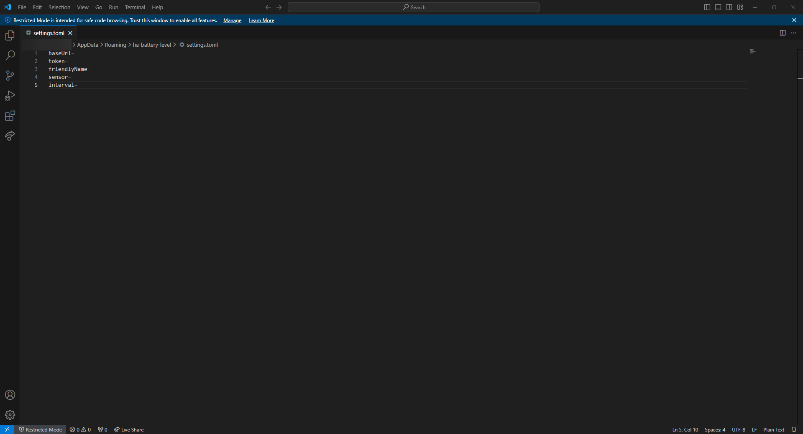

# Home Assistant Battery Level
This is a simple software that will check the battery level of your computer et send it to Home Assistant.

## Compatibility

| OS      | Normally | Tested |
|---------|----------|--------|
| Linux   | ✅        | ❌      |
| Windows | ✅        | ✅      |
| MacOS   | ✅        | ❌      |

## Installation
Simply download the [latest release](https://github.com/oriionn/ha-battery-level/releases/latest) and run the executable.

## Configuration
1. Create a new sensor in Home Assistant (template type)


2. Create a access token in Home Assistant


3. Run the software, a error will appear


4. Open the file path that is in the error message ([Listed here](#config-paths))



5. Edit the file with your Home Assistant informations and save it


6. Run the software again, it should work
7. Add the sensor to your dashboard (Entity Card)

## Config paths
- Windows: `C:\Users\%USERNAME%\AppData\Roaming\ha-battery-level\settings.toml`
- Linux: `~/.config/ha-battery-level/settings.toml`
- MacOS: `~/Library/Application Support/ha-battery-level/settings.toml`

## Development
### Prerequisites
- [Go](https://golang.org/dl/)
#### Linux
Building apps requires gcc as well as the `gtk3` and `libayatana-appindicator3` development headers to be installed. For Debian or Ubuntu, you may install these using:
```bash
sudo apt-get install gcc libgtk-3-dev libayatana-appindicator3-dev
```
(Source: [getlantern/systray](https://github.com/getlantern/systray/?tab=readme-ov-file#linux))

### Building
1. Clone the repository
```bash
git clone https://github.com/oriionn/ha-battery-level.git
```
2. Change directory
```bash
cd ha-battery-level
```

#### Windows
```bash
go build -ldflags -H=windowsgui
```

#### Linux and MacOS
```bash
go build
```

## Credits
- [Johan Stickman](https://github.com/johan-perso) - For the idea and the help with the Home Assistant
- [getlantern/systray](https://github.com/getlantern/systray) - For the tray icon
- [pelletier/go-toml](https://github.com/pelletier/go-toml) - For the TOML parser
- [sqweek/dialog](https://github.com/sqweek/dialog) - For the dialog box

## License
This project is licensed under the MIT License - see the [LICENSE](LICENSE) file for details.